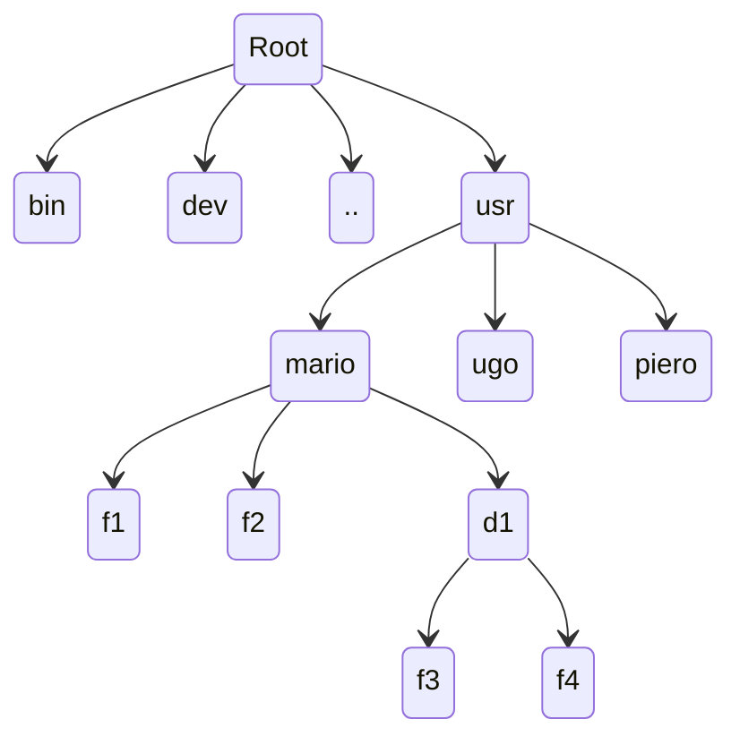

##### Tipi di sistemi operativi :

Quando si accende il PC il processore parte e inizia a leggere dal BIOS cercando un disco caricando i dati da esso alla memoria e man mano esegue il codice e il fetch.

- monoutente e mono-programmato :
	- posso avere solo 1 utente
	- può girare solo un programma alla volta. *(Ex. DOS)*
- monoutente e multi-programmato :
	- consente di usare più programmi alla volta *(Ex. Windows o OS del cell)*
- multiutente e multi-programmato:
	- consente l'utilizzo tra più utenti allo stesso momento
	- consente l'utilizzo di diversi programmi da diversi utenti (Ex. Linux, Mac OS X, Windows NT - server)

- Batch OS : lotti di schede di programmazione
- Multitasking/Time Sharing OS : simulazione di un parallelismo dei programmi, simulando la velocità
- Multiprocessing OS : più processi simulati o effettivi
- Real Time OS : *(Real time - un'attività è real time se esegue la sua attività in un tempo compatibile al lavoro che sta facendo)* un sistema operativo che riesce a svolgere i task in real time.
- Distributed OS : più macchine fisiche collegate tra di loro con più processori per andare più veloce
- Network OS : avere la funzionalità network per poter comunicare in tutto il mondo
- Mobile OS : quello dei cellulari

##### Architettura OS :

L'OS è organizzato in diversi strati, ognuno di essi costituisce una macchina virtuale che gestisce una risorsa del calcolatore.

- Programmi utente
- Interprete comandi (Terminal, shell etc..)
- File System
- **Gestione delle periferiche**
- **Gestione memoria**
- **Gestione dei processi**
- Macchina fisica

**Grassetto** = indispensabili per il funzionamento del sistema e costituiscono il Kernel *(si legge dal basso verso l'alto).*

##### Gestione processi :

Il SO muti-programmato si occupa della gestione delle esecuzioni correnti di più programmi. Per avere però più programmi che girino in parallelo decentemente si ha bisogno di più processori o un processore con più core.

Ha una tabella di schedulazione **(Scheduler)** che gestisce quando far ripartire i vari programmi. Salva il program count della applicazione precedente per poi partire con quella successiva, e questo avviene ogni ca. 1-20ms per far avere all'utente un'esperienza più fluida.

Con i server è meglio che lo scheduler si avvii meno frequentemente ca. 40ms, non avendo bisogno di avere un'interfaccia veloce visto che la cosa più importante è la performance.

Se si ha più processori o core bisogna tenere conto che anno entrambi la propria cache, quindi se si ri-schedula sullo stesso processore o core è molto probabile che esso abbia ancora i dati dell'ultima esecuzione essendo quindi più efficiente nel riaprire il programma.

##### Gestione delle periferiche :

Sono meccanismi software a cui è affidato il compito di trasferire dati alle periferiche, consentendo ai programmi applicativi di leggere o scrivere dati.

- Gestione delle periferiche
- Gestione della memoria
- Gestione dei processi
- Macchina fisica

L'OS si occupa di gestire i file sulla memoria di massa:
- creare un file
- Dargli un nome
- Collocarlo in un opportuno spazio nella memoria di massa
- Accedervi in lettura e scrittura

**Process affinity - indica il core più efficiente**

##### Organizzazione File

A ciascun utente è assegnato una home-directory che ha come nome quello dello user. *(in Linux è però chiamato solo home directory).*
Ognuna di queste contiene altre cartelle di cui ci sono diversi permission dei diversi utenti w-r-x ***(Write - Read - Execute)***.

##### % OSes

##### Kernel Features

- low level scheduling : schedulazione dei processi
- inter-process communication : comunicazione tra processi ma non si vedono
- process synchronization : sincronizzazione tra i processi
- context switching : tecnica di salvare il processo in un core o processo e switchare con un altro processo.

##### Type of Kernels

- monolithic : Linux vecchio, simile ad un unico programma dove se si vuole cambiare qualcosa bisogna ricaricare tutto.
- modulare : parte più velocemente e non ha bisogno di ricaricare tutto come il monolithic.
- microkernel : kernel più piccolo che lavorano solo sul livello più basso, dove i programmi esterni vengono caricati esternamente e quindi non c'è bisogno di ricaricare il kernel come nel monolithic, ma il caricamento dei programmi esterni è più lento e c'è un degrado della performance.

##### Difference between BIOS and Firmware

BIOS - Basic Input Output Software
Firmware - tipo di programmazione installata su un chip contenuto in un device il quale viene controllato da essa. Sono i programmi creati dal "manufacturer" del device. 

Le impostazioni del BIOS vengono installate nella RAM, ma non la ram che è intercambiabile, ma una RAM che viene sostenuta da una batteria sulla motherboard. Per leggere istruzioni dal disco non si può visto che il sistema operativo non è ancora stato installato. Per fare ciò il processore legge in modo binario i "settori" del disco caricando quindi il codice sulla RAM menzionato in precedenza, dopo di che quando sono stati caricati abbastanza stringhe di codice sulla RAM, il processore inizia a "fetch-are" i codici installando l'OS.