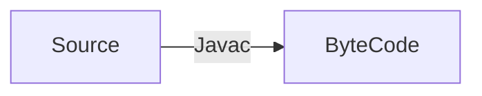

# Cos'è Java  
Java è un linguaggio di programmazione **informale**. Utilizza paradigmi imperativi, con regole di derivazione accettate.  
Si definiscono dei fatti e delle regole di derivazione:

La sintassi di Java è simile al C, ma utilizza un paradigma ad oggetti.  
E' un linguaggio estremamente portabile, robusto (buona gestione degli errori), sicuro, e general purpose. Serve il concetto di **WORA** (Write Once Run Everywhere).  
E' un linguaggio compilato, il cui compilatore non traduce il programma in binario, ma in **bytecode**, un linguaggio macchina di una macchina virtuale chiamata **JVM** (Java Virtual Machine), diversa per ogni calcolatore.  
<code>Javac</code> (il compilatore di java) traduce i file sorgente <code>.java</code> in bytecode con estensione <code>.class</code>. A quel punto la JVM **interpreta** il bytecode traducendolo in linguaggio macchina. Java è quindi sia compilato che interpretato.  
L'**overhead** introdotto riduce in modo significativo le prestazioni, pertanto si implementa, al momento della compilazione, la capacità di riconoscere gli **hotspot** (istruzioni frequenti e ripetute) e salvarli in cache, riducendo il tempo e costo di esecuzione.  
I collegamenti tra funzioni vengono gestiti dal **ClassLoader**, "linkando" bytecode separate che vengono connessi da richiami di classi e funzioni. Il bytecode viene poi sottoposto ad una fase di **verifica** di errori riguardanti le istruzioni dannose. Infine viene fatta l'interpretazione JIT (Just In Time).  

  
## Kit di Strumenti  
- **JVM**: Java Virtual Machine  
- **JRE**: Java Runtime Environment. Composto dalla JVM e altre librerie utile per l'esecuzione da utente.  
- **JDK**: Java Development Kit. Composto dalla JRE e librerie utili per lo sviluppo Java.