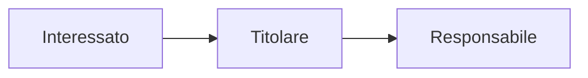

### Aziende

**Capitalizzazione** : Il numero delle azioni in circolazione per il valore dell'azienda al momento.
**Azione** : Parte della società che appartiene agli azionisti che hanno finanziato l'azienda.

Esiste un mercato, in borsa, e non tutte le aziende sono quotate in borsa, ma quelle che ne fanno parte hanno l'obbligo di far vedere le proprie attività. Per questo non tutte le aziende decidono di farne parte, le altre che invece sono quotate hanno la possibilità di entrare in questo mercato e avere più investitori a finanziarli.

****
### Dati e informazioni

**GDPR** $\to$ General Data Protection Regulation
25 maggio 2018 unione europea adotta la GDPR allo scopo di definire le regole per la protezione e la circolazione dei dati personali. *(Dato personale $\to$ qualsiasi dato riguardante una persona fisica indentificata o identificabile)*

**Dato** : rappresentazione obbiettiva e non rappresentata della realtà. *(Ex. numero di fattura, il suo importo, etc...).*
**Informazione** : visione della realtà derivante dall'elaborazione e interpretazione dei dati. *(il significato che diamo ai dati).*

**Dati Personali** : 
- Comuni
	- Identificazione diretta : dati anagrafici, fotografie
	- identificazione indiretta : Codice fiscale, IP, Targa
- Sensibili
	- Religione
	- Area politica
	- Orientamento sessuale
	- Stato di salute
	- Dati biometrici o generici
- Giudiziari
	- Condanne penali
	- Casellari giudiziari
	- Soggiorni obbligatori
	- etc...
- Altri
	- Geolocalizzazione
	- Dati rilasciati via internet o al telefono

****
### 3 parti in gioco

**Interessato (diritti)** : 
- *Informazione* : Sapere quali dati trattati dal Titolare
- *Accesso* : Chiedere ed ottenere in forma leggibile i dati in possesso dal Titolare
- *Aggiornamento* : poter aggiornare e rettificare i dati
- *Cancellazione* : Chiedere ed ottenere la cancellazione dei dati in possesso del Titolare
- *Opposizione* : verso il trattamento di tutti i dati o alcuni
- *Revoca* : Del consenso in qualsiasi momento
- *Trattamenti automatizzati* *(profilazione)* : Opporsi a trattamenti automatici, inclusa la profilazione
- *Anonimato* : Chiedere ed ottenere la trasformazione dei propri dati in forma anonima
- *Limitazione* : Chiedere ed ottenere il blocco o la limitazione dei dati per i quali non è più necessario la conservazione
- *Portabilità* : Chiedere ed ottenere la trasmissione dei dati ad altro Titolare impedimenti da parte di attuale Titolare

