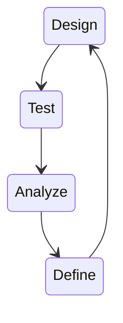

**Agile** $\to$ E' un approccio iterativo (Contenente o indicante ripetizione) per il management dei software che si concentrano alla continua uscita di update,  incorporando il feedback degli utenti.

**Stakeholder** $\to$ Possono essere interni o esterni all'azienda ma non sempre fanno parte del progetto. Soggetto/i interessati al progetto.

### Project

**Project Manager** $\to$ responsabile della pianificazione e controllo di progetti, coordinando persone e processi con l'obbiettivo di consegnare il progetto nel tempo, budget e nei requisiti richiesti per raggiungere uno o più obbiettivi.
(Pianificazione Ex. $\to$ viaggi all'estero, metodo di studio, comprare in futuro una moto etc.)

**Elementi più importanti** :
- Cost
- Time
- Scope
	- Quality (per lo Stakeholder o Clienti o se stessi etc.), si intende come qualità o completezza del progetto, che porta quindi alla qualità degli elementi elencati sopra.

![[elementi importanti.svg]] 

Questo "triangolo" di elementi non può variare, né rimpicciolirsi né ingrandirsi, questo perché andando ad influenzare una voce negativamente porterà ad un impatto su altre voci. (Ex. Un taglio di budget, per esempio diminuire i lavoratori, porterà ad influenzare il tempo o la qualità (fine) del progetto).

### Progetto vs Processo

Progetto $\to$ Si fa solo 1 volta, non è mai ripetibile ed ha un inizio e una fine con un risultato unico.
Processo $\to$ Un insieme di operazioni ripetitive per raggiungere lo stesso risultato.

### Pratica

**Il Project Manager** $\to$ E' colui che coordina le persone e i loro compiti, le tempistiche e requisiti del progetto.

**Pianificazione** $\to$ Per esempio la realizzazione di un videogioco medio porta ad un paio di milioni di euro con la suddivisione di lavori con anche lo stipendio e previsione delle tempistiche. E quindi pensare alle attività richieste per raggiungere gli obbiettivi desiderati.

*(In Project Management si parla in RAL di soldi $\to$ Reddito Annuale Lordo)*

Regola delle 5W e 1H : 
- Who
- What
- Why
- When
- Where
- How

**Sponsor/Investitori** $\to$ Sono coloro che mettono in palio una somma di denaro per una percentuale del "revenue" del progetto, aiutandolo finanziariamente, ma quello che li attira sono le motivazioni del progetto.

### Tipologie di Progetti e Project Management

**Predittivo** : 
Si prova a *prevedere*, *anticipare* con il progetto. (sono progetti che devono essere precisi e senza errori)

| Plan and Driven |
| --- |
| Requirements / Scope Fixed |
| Uses analysis over discovery |
| Big upfront design |
| Architecture pre-determined |
| Estimates given up front |
| Forecasting based on upfront estimates |
| Requirements treated as of equal priority |

Le persone dovranno aderire al piano del progetto che non può cambiare perché é predittivo il progetto e ciò vale per gli altri elementi. Riassunto elementi : [Predittivo](https://docs.google.com/presentation/d/1dMOYdDBmhMT8A-juNNXloJlThUNvt3C0/edit#slide=id.g17e401812e9_0_63).

**Adattivo** : 
Un progetto che *favorisce* o *consente* l'adattamento. (solitamente in ambienti ingegneristici, sono soprattutto i progetti che sono soggetti a variazioni)

| Planning and Driven |
| --- |
| Requirements / Scope variables |
| Uses discovery over analysis |
| Initial upfront design |
| Architecture evolver | 
| Estimates constantly revised |
| Forecasting driven by work already delivered |
| Requirements prioritized by value to the business |

Il Planning qua invece è diverso perché i lavoratori si dovranno adattare ad una continua pianificazione del progetto e ciò vale per gli altri elementi. Riassunto elementi : [Adattivo](https://docs.google.com/presentation/d/1dMOYdDBmhMT8A-juNNXloJlThUNvt3C0/edit#slide=id.g17e401812e9_0_73).

**Waterfall** $\to$ metodo per eccellenza per eseguire il metodo Predittivo, soprattutto usato per il ciclo di vita di un software. Strutturato in una sequenza di fasi o passi.

- Requirements
	- Design
		- Implementation
			- Testing
				- Maintenance

Il rischio in questo metodo non diminuisce fino alle fasi di test e delivery del progetto.

**Agile** $\to$ metodo per eccellenza per eseguire il metodo Adattivo, proponendo un approccio focalizzato sull'obbiettivo di consegnare al cliente, in tempi brevi e frequentemente, software funzionanti e di qualità 

Il rischio invece in questo metodo diminuisce con ogni iterazione.

**Ambito Business** $\to$ nei progetti *adattivi* con ogni iterazione ci si avvicina sempre di più alle aspettative del progetto, perché le esigenze cambiando nel tempo esso si adatta a queste. Mentre con l'aumentare del tempo nei progetti *predittivi* ci si allontana sempre di più dalle aspettative e dalla reale esigenza del progetto perché le esigenze cambiano nel tempo. [Grafico](https://docs.google.com/presentation/d/1dMOYdDBmhMT8A-juNNXloJlThUNvt3C0/edit#slide=id.g14bca983935_0_664).

