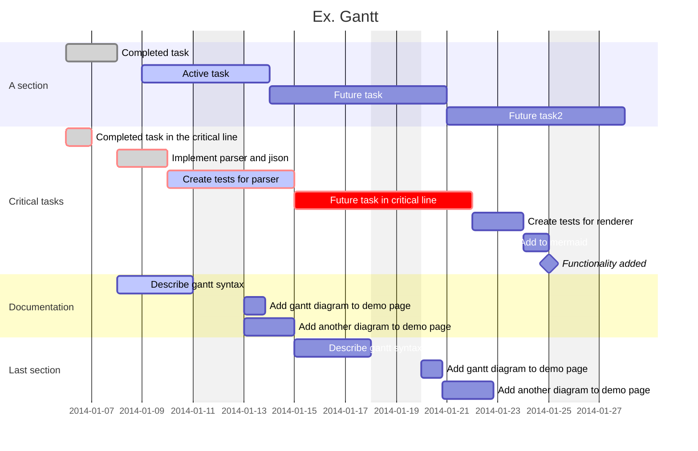

### Sommario : 
- La pianificazione Agile :
	- Idea di alto livello *( Un progetto di alto livello è di alto livello quando si hanno più informazioni nel dettaglio.)*
	- Identificazione Epic *(Un livello più specifico delle macro aree)*
	- WBS delle Epic in Story *(le Epic vengono scomposte in Story più piccole e messe nella WBS)*
	- Fornire le stime
	- Realizzare una roadmap
	- Condividere, revisionare, migliorare
- Esercizio
- Discussione
### Come fare la pianificazione di un progetto Kanban o Scrum

Triangle of management : 

![[elementi importanti.svg]]
- **Idea di alto livello :**
	- Che cosa stiamo sviluppando? Qual è l'obbiettivo del progetto?
	- Una casa
	- Un nuovo sistema informatico
	- Il cambio dell'infrastruttura di un'azienda
	- un aggiornamento delle regole di sicurezza
	- etc...
- In un contesto aziendale Agile, ogni progetto potrebbe rientrare in un "tema" preciso. *(Un tema è una grande era con elementi in comune, che aiuta i team Agile a tenere sotto controllo gli obbiettivi aziendali)*

- **Identificare le Epic :**
	- Un epic Agile è una porzione di lavoro che può essere suddivisa in task specifici (chiamati storie utente) in base alle esigenze/richieste dei clienti o degli utenti finali. 
	- Ex. Progetto : Aggiornamento della sicurezza. - Epic : Miglioramento della sicurezza degli account personali, aggiornamento delle policy, cambio di provider di posta elettronica, aggiornamento del software del server all'ultima versione. *(non andare troppo nello specifico con le aree, vai nel più generale possibile)*.

- **Definire le release (le versioni) :**
	- Ex. Le patch dei videogioco con nuove versione, alpha, beta, demo, oppure la first playable che è la primissima versione giocabile.
	- Sono importanti perché serve a limitare le funzionare della applicazione e gli utenti si aspettano di non avere tutte le funzionalità.
	- Facendo ciò ci aiuta a porre degli obbiettivi, **Le Milestone/Release intermedie**, un punto nel tempo specifico che serve a specificare quali attività fanno parte di quella release.

- **Divagazione** :
	- Con l'avvenimento di Cloud, si è passato dalla programmazione monolite (tutto in una volta) a programmazione micro service, ovvero una tecnica di programmazione dove si programmano tante piccole applicazione che insieme creano il servizio in se. Ex. Spotify.
	- SAAS : software as a service, con update in live stream e non ce ne accorgiamo neanche. Girano su Cluster (server virtuali con istanze dove i software si ripetono per i clienti), quando c'è un'aggiornamento l'amministratore può decidere di lasciare aperto l'update a un numero limitato di clienti e rilasciarlo se va bene. Software on Premise : i software che sono a pagamento.

-  **Realizzare una WBS delle Epic in Story :**
	- Definizione Di User Story : è una spiegazione informale di una funzione del software dalla prospettiva dell'utente finale. (Ex. Voglio trovare sulla home-page una sezione delle offerte con un timer che indica quando finirà l'offerta). Sono create generalmente dai Product Owner.
	- Le story hanno un template : "As a.... I want... so that... because".
		- *Epic :* 
			- Miglioramento della sicurezza degli account personali.
		- *Story :*
			- Come azienda, voglio che i dipendenti facciano il login ai sistemi tramite una doppia autenticazione, per essere sicuri che siano loro.
			- Come azienda, voglio che l'account dei dipendenti effettui il log out automatico dopo 30m, per evitare che sessioni prolungate aumentino il rischio di frode.
- WBS :
![[Screenshot 2023-11-06 101827.png]]

- **Fornire le Stime :**
	- Story points are units of measure for expressing an estimate of the overall effort required to fully implement an item or any other piece of work.
	- Con le stime e il sistema di Fibonacci, non si hanno nessuna misura di tempo, in fatti non indica una stima del tempo ma dello sforzo che si impiega per completare quella story. Questo perché l'Agile è suddiviso in Sprint ma gli sprint sono periodi di tempo fisso che vengono decisi dalle aziende.

|Story ID|Story|Estimate (Story Point)|
|---|---|---|
|ARS-S-1|Come azienda, voglio che i dipendenti facciano effettuino il login ai sistemi aziendali tramite una doppia autenticazione, per essere sicuri che siano loro ad effettuare l’accesso|13|
|ARS-S-2|Come azienda, voglio che l’account dei dipendenti effettui il log-out automatico dopo 30 min, per evitare che sessioni prolungate aumentino il rischio di frode|8|**

*Sprint : cadenza del tempo.
Velocità : quantitativo di quanti story points sono stati completati negli ultimi 3 sprint.
Story points : rappresentano stima dello sforzo di ogni attività e sono le nostre stime.*

- **Realizzare la roadmap :**
	- Viene, di base, rappresentata con un Gantt.

Per creare la Roadmap si ha bisogno di sapere quante iterazioni si hanno avuta.
![[Screenshot 2023-11-06 104100.png]]

Il totale degli story point/la velocità del team = la data di fine del progetto stimata

**Velocity Chart** : Ci dice ogni sprint quanto abbiamo pianificato e quanto invece il team ha completato, e ci aiuta a calcolare la velocità media.
![[Screenshot 2023-11-06 104442.png]]

### Cosa ricordare :
- Scope di progetto definito in Tema/iniziativa/Epic/Story
- Velocità del team
- Quante risorse abbiamo a disposizione nel nostro team (per il costo dello sprint e come distribuire il lavoro) - Il costo dello Sprint viene calcolato per risorse umane visto che prevede che il team rimanga fisso.

### Condividere, Revisionare, Migliorare
Il team di lavoro, bisogna confrontarsi con essi con i calcoli e ci daranno il feedback, perché se lo consegnassimo al cliente senza farlo vedere al team di lavoro, stiamo togliendo ad essi il sistema di autogestione.