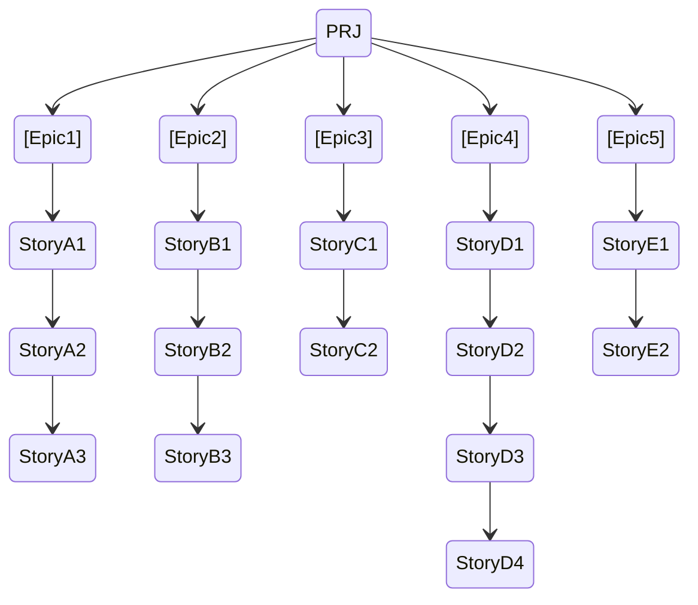

 Realizzare la pianificazione di un progetto di miglioramento della sicurezza dei dati di un’azienda. (minimo 3-4 sprint)

Time: 60’
Team Velocity: 100 SP
Sprint length: 2 w
Team Cost x Sprint: 10k €

**Output attesi**
WBS
Pianificazione
Totale costo progetto

- **Epic :**
	- Miglioramento della sicurezza degli account utenti.
	- Miglioramento sicurezza DB
	- Miglioramento sicurezza sito
	- Aggiornamento software ultima versione macchine

- **Story  :**
	- Miglioramento Account :
		- Come azienda, voglio che venga implementato la doppia autenticazione per essere sicuri che siano loro [Estimated 33SP]
		- Come azienda, voglio che all'account aziendale avvenga un logout automatico se l'utente è in AFK per 30m per prevenire azioni maliziosi da "third parties". [Estimated 48 SP]
		- Come azienda, voglio che gli account degli utenti abbiano un'aggiornamento obbligatorio delle password ogni mese, per aumentare ancora di più la sicurezza [Estimated 39 SP]
	- Miglioramento DB :
		- Come azienda, voglio che il database abbia un aggiornamento delle credenziali ogni tot tempo per essere sicuri che nessuna "third parties" entri nel DB [Estimated 40 SP]
		- Come azienda, voglio che il database venga "backuppato" ogni settimana in un database secondario in modo da non perdere dati in caso di disastri. [Estimated 54 SP]
		- Come azienda, voglio che si inizino ad utilizzare migliori metodi di criptazione dei dati per assicurare la sicurezza dei dati degli utenti. [Estimated 43 SP]
	- Miglioramento sito :
		- Come azienda, voglio che il codice e vari elementi importanti del sito vengano criptati per evitare che vengano rubati da "third parties" [Estimated 38 SP]
		- Come azienda, voglio che i dati del sito vengano "backuppati" in modo da prevenire crash o hack da "third parties" [Estimated 54 SP]
	- Aggiornamento macchine :
		- Come azienda, voglio che ogni macchina sia aggiornata all'ultima versione dell'OS per avere i software di sicurezza sempre aggiornati. [Estimated 43 SP]
		- Come azienda, voglio che ogni macchina abbia i driver di sicurezza (di periferiche e non) aggiornati per evitare virus etc.. [Estimated 33 SP]
		- Come azienda, voglio che vengano installati software per la gestione remota delle macchine e vari antivirus, per prevenire accessi non autorizzati alla macchina [Estimated 23 SP]
		- Come azienda, voglio che vengano installati diversi filtri per il web nei browser dei lavoratori per evitare la diffusione di virus indesiderati. [Estimated 30 SP]
	- Controllo device :
		- Come azienda, voglio che i device connessi alla rete inizino ad essere controllati più frequentemente per evitare l'intrusione di persone maliziose. [Estimated 59 SP]
		- Come azienda, voglio che nei device aziendali vengano installati sistemi di tracking in caso alcuni di essi vengano rubati. [Estimated 47 SP]

[Roadmap](https://docs.google.com/spreadsheets/d/1w8azcALZGSGWPNqQANrsL9_UZ5NXyUKaZnYYju5p7Cs/edit#gid=0)

Grafico Burnup : Sprint 5
![[BurnUp.svg]]
